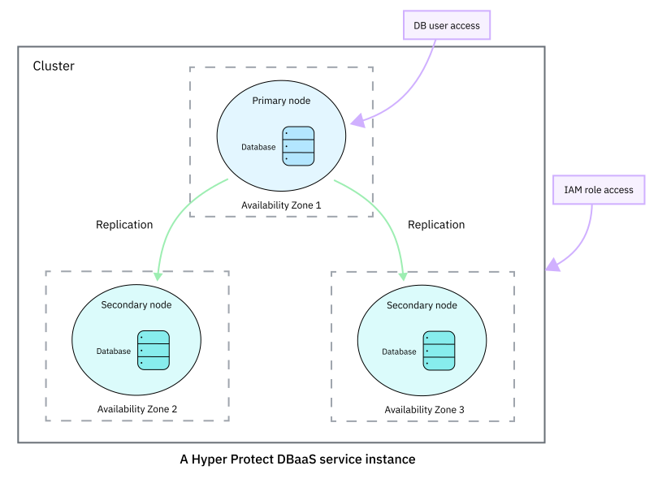

---

copyright:
  years: 2019, 2020
lastupdated: "2020-12-22"

keywords: hyper protect dbaas, hyper protect dbaas for mongodb, mongodb, cloud database, data security, secure database, encrypted database

subcollection: hyper-protect-dbaas-for-mongodb

---

{:shortdesc: .shortdesc}
{:codeblock: .codeblock}
{:important: .important}
{:screen: .screen}
{:codeblock: .codeblock}
{:tip: .tip}
{:pre: .pre}
{:note: .note}
{:term: .term}
{:video: .video}
{:external: target="_blank" .external}
{:help: data-hd-content-type='help'}
{:support: data-reuse='support'}

# Getting started with {{site.data.keyword.cloud_notm}} {{site.data.keyword.ihsdbaas_mongodb_full}}
{: #gettingstarted}

{{site.data.keyword.cloud}} {{site.data.keyword.ihsdbaas_full}} provides tamper-proof, enterprise cloud database environments with high availability for workloads with sensitive data. It offers a flexible platform that allows you to easily provision and manage your database of choice, without data security concerns.
{: shortdesc}

For more information about the industry-leading data security level of {{site.data.keyword.ihsdbaas_mongodb_full}}, see [Securing your data in {{site.data.keyword.ihsdbaas_mongodb_full}}](/docs/hyper-protect-dbaas-for-mongodb?topic=hyper-protect-dbaas-for-mongodb-data-security).

{{site.data.keyword.ihsdbaas_mongodb_full}} provides {{site.data.keyword.mongodb}} database clusters in the {{site.data.keyword.cloud_notm}}. Each {{site.data.keyword.ihsdbaas_full}} database cluster has one primary node and two secondary nodes (replicas that back up the primary). For more information about high data availability, see [High availability and disaster recovery](/docs/hyper-protect-dbaas-for-mongodb?topic=hyper-protect-dbaas-for-mongodb-high-availability-disaster-recovery).

With {{site.data.keyword.cloud_notm}} {{site.data.keyword.ihsdbaas_mongodb_full}}, you can create database clusters, scale your resources, view information about your nodes, databases, and users, monitor databases, and view service logs.

Watch the following video to find out how to get started with {{site.data.keyword.cloud_notm}} {{site.data.keyword.ihsdbaas_full}}:

{: video output="iframe" data-script="none" id="mediacenterplayer" frameborder="0" width="560" height="315" allowfullscreen webkitallowfullscreen mozAllowFullScreen}

## Supported version
{: #mongodb_supported_version}

{{site.data.keyword.ihsdbaas_mongodb_full}} currently supports {{site.data.keyword.mongodb}} EE 4.4. It provides a secure, up-to-date version of the {{site.data.keyword.mongodb}} Enterprise database. We upgrade database maintenance versions `major.minor.maintenance` when appropriate.

## Prerequisites
{: #prerequisite}

1. To use the UI, make sure you're using the [required browser software](/docs/overview?topic=overview-prereqs-platform) for {{site.data.keyword.cloud_notm}}.

  For Safari, ensure that the **Prevent cross-site tracking** and **Block all cookies** options under **Safari > Preferences > Privacy** are not selected.

  If you encounter problems when you use one of the required browsers, disable your browser plug-ins.

2. You can create a 30-day free plan service instance with a Lite {{site.data.keyword.cloud_notm}} account. To create a paid service instance, make sure you have a [Pay-As-You-Go or Subscription {{site.data.keyword.cloud_notm}} account](/docs/account?topic=account-accounts).

  To check your account type, go to [{{site.data.keyword.cloud_notm}}](https://cloud.ibm.com/){: external} and click **Management** > **Account** > **Account settings**.

  If you have a Lite account and want to create a paid service instance, [upgrade your account to a Pay-As-You-Go or Subscription account](/docs/account?topic=account-upgrading-account).

## Step 1. Create a service instance
{: #creating-a-database-cluster-introduction}
{: help} 
{: support}

When you create a service instance, you create a cloud database cluster (replica set) with one primary and two secondary nodes as replicas, as shown in the following diagram. 

{: caption="Figure 1. A {{site.data.keyword.ihsdbaas_full}} service instance with high availability" caption-side="bottom"}

You can create a service instance through the UI, the CLI, and the API. For more information and detailed instructions, see [Creating a service instance](/docs/hyper-protect-dbaas-for-mongodb?topic=hyper-protect-dbaas-for-mongodb-create-service).

Free plans are available. They are designed for evaluation purposes and are not suitable for production usage. If you create free-plan instances, note that they will be automatically deleted 30 days after creation.
{: note}

## Step 2. Connect to databases
{: #accessing-database-introduction}

You can use the mongo shell, your favorite {{site.data.keyword.mongodb}} driver, or tools like {{site.data.keyword.mongodb}} Compass to connect to your databases. {{site.data.keyword.ihsdbaas_mongodb_full}} allows only [SSL](#x2038004){: term}-secured client connections. 

### Before you begin
{: #accessing-database-introduction-byb}

The tool that you use needs to be compatible with {{site.data.keyword.mongodb}} EE 4.4 that is supported by {{site.data.keyword.ihsdbaas_mongodb_full}}.

To enable verification of the server certificate during database connection, download the [certificate authority (CA)](#x2016383){: term} file from the **Manage** page of the service dashboard, and copy it to the appropriate directory.

#### Using mongo shell
{: #accessing-database-introduction-connect-mongoshell}

[Download the mongo shell](https://www.mongodb.com/download-center/enterprise){: external} as part of the {{site.data.keyword.mongodb}} Server or as a stand-alone package. To check whether the version is compatible with {{site.data.keyword.mongodb}} EE 4.4 supported by {{site.data.keyword.ihsdbaas_mongodb_full}}, see [{{site.data.keyword.mongodb}} Release Notes](https://docs.mongodb.com/manual/release-notes/){: external}.

To use the mongo shell to connect to your databases, run the following command. You can copy the command from the service dashboard. For more information about the mongo shell, see the [mongo shell documentation](https://docs.mongodb.com/manual/mongo/){: external}.

```
# mongo 'mongodb://<host_name_1>:<port_1>,\
<host_name_2>:<port_2>,\
<host_name_3>:<port_3>/admin?replicaSet=<cluster_name>' \
--tls --username <user_name> --password <password> --tlsCAFile <CAFile>
```
{: codeblock}

**Command options**

- *host_name_i*

  The name of the host server that hosts the node.

- *port_i*

  The port to connect to the corresponding host.

- *cluster_name*

  The {{site.data.keyword.mongodb}} cluster name that you set when you create the service instance.

- *user_name*

  The user name for the database admin as specified in the service creation page.

- *password*

  The password for the database admin as specified in the service creation page.

- *CAFile*

  The path of the `cert.pem` file that you downloaded from the service dashboard.

#### Using {{site.data.keyword.mongodb}} Compass or other tools
{: #accessing-database-introduction-connect-mongodb-compass}

For other tools, such as [{{site.data.keyword.mongodb}} Compass](https://docs.mongodb.com/compass/master/install/){: external}, {{site.data.keyword.ihsdbaas_mongodb_full}} supports *SSL server certificate validation* to connect to the host.

For example, to use {{site.data.keyword.mongodb}} Compass to connect to your databases, complete the following steps:

1. Copy the cluster URL from the **Manage** page in the {{site.data.keyword.ihsdbaas_mongodb_full}} service dashboard.
2. Open {{site.data.keyword.mongodb}} Compass. On the **New Connection** page, paste the cluster URL.
3. Click **Fill in connection fields individually**.
4. For **Authentication**, select **Username / Password**. Enter your user name and password.
5. Click the **More Options** tab. In the **SSL** field, select **Server Validation** . Upload the certificate authority file that you downloaded from the service dashboard, and click **CONNECT**.

##  Step 3. Manage the database cluster
{: #managing-database-cluster-introduction}
{: help} 
{: support}

Each {{site.data.keyword.ihsdbaas_mongodb_full}} cluster contains a DBaaS Manager, which manages and intelligently schedules your requests based on the available resources.

In a database cluster, you can:
- Scale your resources
- View information about databases, users, and nodes
- View service logs
- Monitor databases
- ...

You can send the requests to the DBaaS Manager through the UI, the CLI, and the API. For detailed instructions, see [Managing your service instance](/docs/hyper-protect-dbaas-for-mongodb?topic=hyper-protect-dbaas-for-mongodb-manage-service).

To create or delete your databases and database users, use your database client.

## Step 4 (Optional). Migrate from {{site.data.keyword.mongodb}} databases
{: #migrating-from-mongodb}

To migrate from {{site.data.keyword.mongodb}} databases to {{site.data.keyword.ihsdbaas_mongodb_full}}, follow the [migration instructions](/docs/hyper-protect-dbaas-for-mongodb?topic=hyper-protect-dbaas-for-mongodb-migration_mongodb).
